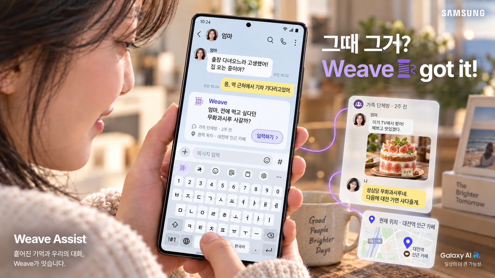

# 그때 그거? Weave🧵 got it!

> Weave Assist는 대화·메모·캘린더·사진 등에 흩어진 기억을 엮어, 필요한 순간 건네는 온디바이스 AI입니다.
>
> Keyword: 기록 통합 검색, 맥락 기반 추천, 자동 완성, Seamless UX, 온디바이스 AI

# Page 1. Teaser (재웅)



>Weave Assist는 사용자의 기록을 연결하여 필요한 순간에 제공하는 온디바이스AI 솔루션입니다. 대화, 메모, 캘린더, 사진 등 다양한 출처의 정보를 통합 검색하고 자동 완성 기능을 제공하며, 현재 맥락과 관련된 기억을 먼저 제안하여 사용자의 편의성을 극대화합니다.
>
---

# Page 2. Motivation (이준)

### [Background]

제 스마트폰엔 지난 5년 치 카카오톡 대화, 1만 장의 사진, 500개의 삼성노트, 그리고 수많은 일정이 잠들어 있습니다. 하지만 이 방대한 기록을 곁에 두고도, 정작 무엇인가 필요한 순간에는 이렇게 말하곤 하죠. “잠깐만, 찾아볼게.”

우리는 세상 모든 질문을 AI에 건네면서, 정작 **내가 나눈 대화, 저장한 사진, 적어 둔 메모**는 여전히 직접 찾아다닙니다. 어디에 남겼는지 모르거나, 정확한 이름이 떠오르지 않거나, 그런 기억이 있었다는 사실조차 잊기도 합니다.

실제로 Microsoft의 2023 Work Trend Index에서는 응답자의 **62%가 업무 중 정보를 찾는 데 너무 많은 시간을 쓰는 어려움**을 겪는다고 답했습니다. 기록을 남기는 것과, 필요할 때 꺼내 쓰는 것은 다른 문제입니다. [Microsoft 원문](https://www.microsoft.com/en-us/worklab/work-trend-index/will-ai-fix-work)

*31개 시장의 취업자·자영업자 31,000명 대상 설문(2023.02~03). 업무 정보 탐색에 관한 결과로, 스마트폰 개인 기록만을 조사한 수치나 Weave의 효과 측정값은 아닙니다. 위 개인 기록량은 예시 사용자 기준입니다.*

### [Suggestion]

AI가 세상의 지식을 설명하는 데서 나아가, 내가 남긴 기록을 연결하고, 미처 떠올리지 못한 기억까지 필요한 순간 건네 준다면 어떨까요?

### [추천 구성안]

- 카카오톡·삼성노트·메일·캘린더·갤러리·위치 아이콘과 기록을 화면 곳곳에 흩어 배치합니다. 중앙에는 “잠깐만, 찾아볼게.”를 놓아, 기록의 양과 실제 활용 사이의 간극을 보여줍니다.
- `대화 5년 치 · 사진 1만 장 · 메모 500개` 등의 수치를 사용할 경우 예시 사용자 기준이라고 표시합니다.

---

# Page 3. Pain Points (이준)

> “기록은 남아 있지만, 꺼내 쓰는 과정은 여전히 번거롭습니다. **어디에** 적었는지 모르고, **무엇을** 찾는지 정확하게 기억나지 않고, 때로는 **그런 기억이 있었는지조차** 떠오르지 않습니다.”
> 

**Pain Point 1.** “어제 적어둔 건 확실한데, **어디에** 적었더라?”

- 회의 내용은 삼성노트에, 작업하던 파일은 내게 쓴 메일에, 퇴근 중 급한 메모는 나와의 채팅에 남깁니다. 찾으려는 내용은 알지만, 어느 앱에 저장했는지 몰라 하나씩 확인해야 합니다. **“잠시만요, 찾아보고 나중에 다시 연락드릴게요.”**

**Pain Point 2.** “검색창은 켰는데, **이름이 뭐였더라?**”

- 저번 달 친구 집들이에서 마신 와인을 다시 찾아보고 싶지만, 정확한 이름이 떠오르지 않습니다. 캘린더에서 집들이 날짜를 확인하고, 갤러리에서 그 사진을 찾느라, 검색을 시작하기도 전에 여러 앱을 오가게 됩니다.

**Pain Point 3.** “아, 그때 엄마가 그 얘길 했었는데.. **지나칠 뻔 했네!**”

- 가족과의 대화 중 엄마가 흘린 한마디, 지나가듯 말한 친구의 취향. '기억할 정보'로 저장된 적이 없어서, 쓸모 있어지는 순간, 그런 말이 있었다는 것 자체가 떠오르지 않습니다.
- 검색은 있는 줄 아는 것만 찾아 줍니다. **있는 줄 모르는 기억은 검색으로 꺼낼 수 없습니다.**

### Target User

| **가상 페르소나** | **불편** | **기대하는 것** | Pain Point |
| --- | --- | --- | --- |
| 성빈, 28세 신입사원 | 바쁜 회사생활 중 노트·사진·문자 등으로 부지런히 기록을 남기지만, 정작 필요할 땐 어느 앱에 있는지 찾느라 진땀을 뺀다. 통화 중엔 “잠시만요”가 입에 붙었다. | “앱 사이를 이동하면서 기록했던 정보를 찾느라 소중한 시간을 낭비하고 싶지 않아요.” | 1, 2 |
| 지현, 26세 관계 지향적 직장인 | 가족·친구와 매일 소통하지만, 흘려 들은 말과 작은 약속을 다 기억하진 못한다. 가까운 사람들의 취향과 작은 바람을 챙기고 싶다. | “가족·친구들이 흘린 말 한마디를 놓치지 않고 제때 챙겨주고 싶어요.” | 2, 3 |

### [추천 구성안]

- 상단에 Pain Point 세 개를 같은 크기로(상단 (좌/중앙/우) 배치), 하단에 페르소나 둘과 기대하는 것을 적는다. (e.g., “앱 사이를 이동하느라 소중한 시간을 낭비하고 싶지 않아요.”, “가족·친구들이 흘린 말 한마디를 놓치지 않고 제때 챙겨주고 싶어요.”)
- 이 페이지에서는 해결 기능까지 설명하지 않고, **누가 어떤 불편을 겪는지**에 집중한다.

---

# Page 4. Solution — Weave Assist 🧵 (서윤 & 지현)

> Weave Assist는 대화·메모·캘린더·갤러리 등에 흩어진 기억을 엮어, 필요한 순간 건네는 온디바이스 AI입니다.
> 

**내 기록** — 대화 · 메모 · 메일 · 일정 · 사진 등  
**현재 맥락** — 작성 중인 내용 · 대화 흐름 · 시간 · 위치 등

| UX | 언제 | 어떻게 | 사용 경험 |
| --- | --- | --- | --- |
| **UX 1. 전역 검색** | 사용자가 필요한 내용을 알고 직접 찾을 때 | Weave 검색 패널을 열고 내용을 입력 | 여러 앱의 관련 기록을 **출처별 목록**으로 단번에 확인 |
| **UX 2. 자동 완성** | 입력할 내용이 정확히 기억나지 않을 때 | 키보드의 **🧵 버튼**을 선택 | 맥락에 맞는 **답장·검색어·추천 문구와 출처**를 확인하고 즉시 입력 |
| **UX 3. 먼저 건네는 기억** | 지금 도움이 될 기억을 미처 떠올리지 못했을 때 | 관련 기억이 감지되면 **🧵 버튼에 알림 표시(Flickering)** | 현재 상황에 맞는 기억과 출처를 확인하고 대화에 활용 |

기록은 출처와 함께 확인하고, 입력할 내용은 사용자가 선택합니다.

---

# Page 5. UX 1 — 전역 검색 (서윤 & 지현)

> 필요한 내용을 검색하면, 관련 기록을 한곳에서 확인합니다.
> 

### 대표 시나리오 — 통화 중 업무 기록 확인

신입사원 성빈은 선배와 함께 **A사 제품 시연을 준비**하고 있습니다. 어제 준비회의를 마쳤고, 오늘 아침 버즈를 끼고 선배와 통화합니다.

> 
> 
> 
> **선배:** “프로님, 어제 A사 **시연 준비회의에서 시연 순서**를 어떻게 정했죠? **수정 중이던 발표자료**랑 **오늘 집합 시간**도 확인 부탁드려요.”
> 

성빈은 내용을 기록해 둔 것은 기억하지만, 노트와 메일, 나와의 채팅 중 어디에 무엇을 남겼는지 바로 떠오르지 않습니다.

| 출처 | 그곳에 남긴 이유 | 저장된 내용 |
| --- | --- | --- |
| **삼성노트** | **회의 중** 정해진 내용을 바로 정리 | **「A사 시연 준비회의」** — 설치 → 연결 → 사용 예시 순서. 전체 시연은 5분. |
| **본인에게 보낸 업무 메일** | **퇴근 전**, 마무리하지 못한 수정사항과 문서 위치를 정리 | 「A사 시연 자료 — 내일 수정할 것」<br>7쪽: 연결 화면 캡처 교체<br>9쪽: 설명을 세 문장으로 축약<br>자료 위치: 사내 문서함 링크 |
| **카카오톡 · 나와의 채팅** | **귀가 중**, 추가로 전달받은 안내사항을 잊지 않으려고 짧게 메모 | **“A사 시연, 내일 8:40 1층 로비. 충전 어댑터 챙기기.”** |

- 세 앱이 각각 **회의 결정사항 / 작업 중인 파일 / 뒤늦게 추가된 안내**를 담게 됨. (하루 동안 다른 상황에서 생긴 기록)

### 인터랙션

**통화 유지 → 하단 Weave 호출 영역을 위로 스와이프 → 검색 패널 열기 → 검색어 입력**(또는 현재의 matching 기반 역 검색창과 구분하려면, 스와이프 후 Weave 버튼 누르기?)

> **검색어: “어제 A사 시연 준비”**
> 


### 결과 화면

> **삼성노트 · 어제 오후 2:10**
> 
> 
> **A사 시연 준비회의**
> 
> 설치 → 연결 → 사용 예시 / 전체 시연 5분
> 
> `원문 보기`
> 

> **메일 · 나에게 보냄 · 어제 오후 6:20**
> 
> 
> **A사 시연 자료 중 내일 수정할 것**
> 
> 7쪽 연결 화면 교체 / 9쪽 설명 축약
> 
> `메일 보기`
> 

> **카카오톡 · 나와의 채팅 · 어제 오후 8:55**
> 
> 
> **A사 시연 집합 안내**
> 
> “내일 8:40 1층 로비. 충전 어댑터 챙기기.”
> 
> `원문 보기`
> 

성빈은 목록을 확인하며 통화를 이어간다.

> **“설치, 연결, 사용 예시 순서로 5분입니다. 집합은 8시 40분이고요. 발표자료는 수정 중인 작업본이라 확인해서 보내드리겠습니다.”**
> 

**[강조할 점]**

- 통화가 유지되는 상단 표시, 위로 올라오는 검색 패널, 서로 다른 출처의 카드 세 개를 보여줌.
- 통화 내용은 AI가 듣는 것이 아니라 사용자가 직접 검색어로 입력합니다.

# Page 6. UX 2 — 자동 완성 (서윤 & 지현)

> 입력 중 Weave🧵 버튼을 누르면, 내 기록과 현재 맥락에 맞는 답장·검색어·문구를 추천합니다.
> 

### 대표 시나리오 — 일정과 사진을 연결해 검색어 완성

서연은 친구 지은의 집들이에서 마신 와인을 다시 찾아보려 합니다. 병 사진을 찍어 둔 것은 기억하지만, 이름과 사진을 찍은 날짜가 바로 떠오르지 않습니다.

Google 검색창에 기억나는 대로 입력합니다.

> **“지은이네 집들이 때 마신 와인”**
> 


### 연결하는 기록

| 기록 | 확인하는 정보 |
| --- | --- |
| **삼성 캘린더** | 지난주 일요일의 **‘지은 집들이’** 일정 → 사진을 찾을 날짜 |
| **갤러리** | 해당 시간대에 촬영한 와인 사진 → 라벨에 적힌 제품명 |

여기서 캘린더는 **‘언제 찍은 사진을 봐야 하는지’**, 갤러리는 **‘무슨 와인이었는지’**를 알려 줍니다.

### 인터랙션

**검색창에 입력 → 키보드의 🧵 버튼 선택 → 후보와 출처 확인 → 후보를 눌러 검색창에 반영**

### 키보드 위 자동 완성 화면

> **자동완성 후보**
> 
> 
> `배비치 소비뇽 블랑`
> 
> **연결한 기록**
> 
> `캘린더 · 지난주 일요일 ‘지은 집들이’`
> 
> `갤러리 · 같은 날 촬영한 와인 라벨 사진`
> 
> `검색창에 넣기`
> 

사용자가 후보를 선택하면 다음과 같이 바뀝니다.

> **지은이네 집들이 때 마신 와인**
> 
> 
> ↓
> 
> **배비치 소비뇽 블랑**
> 

**[화면에서 강조할 점]**

- Google 검색 화면은 그대로 유지하고, 키보드 위에서 **입력 문구 → 🧵 버튼 → 후보 칩 → 출처 두 개**가 이어지도록 보여줍니다.
- 여기서는 **‘누르자마자 자동 치환’보다 ‘후보를 확인하고 선택하면 반영’**으로 표현하는 게 좋음. 자동완성이라는 편리함을 살리면서도, 사용자가 작성한 내용을 임의로 바꾸지 않는 UX가 됨.
- 시연에는 라벨이 읽히는 사진을 사용합니다.

---

# Page 7. UX 3 — 먼저 건네는 기억(서윤 & 지현)

> 지금의 대화와 상황에 도움이 되는 기억을 묻기 전에 알려줍니다.
> 

### 대표 시나리오 — 과거의 약속을 현재 위치와 연결

첫 장의 티저에서 이 페이지에는 UI와 카드만 사용할 것


지현은 대전 출장을 마치고 역으로 이동하는 중입니다. 엄마에게 답장을 쓰지만, 예전에 사다 주겠다고 했던 케이크는 떠올리지 못합니다.

> **엄마:** 출장 다녀오느라 고생했어! 집 오는 중이야?
> 
> 
> **지현:** 응, 역 근처에서 기차 기다리고 있어.
> 

### 2주 전 가족 단체방

> **엄마:** `[무화과시루 사진]`
> 
> 
> “이거 TV에서 봤어! 예쁘고 맛있겠다.”
> 
> **지현:** “성심당 무화과시루네. 다음에 대전 가면 사다줄게.”
> 

제품명이 서연의 답장에도 남아 있으므로, 이 시나리오에서는 **갤러리 분석 없이 과거 대화 기록을 중심으로** 구성할 수 있습니다.

### 현재 상황과 연결

> **과거 대화**
> 
> 
> 엄마가 무화과시루를 먹고 싶어 했고, 서연은 다음에 사다 주겠다고 말했습니다.
> 
> **현재 위치 (GPS)**
> 
> 서연이 해당 제품의 판매 지점 인근에 있습니다.
> 

### 인터랙션

**엄마에게 답장 작성 중 → 키보드 왼쪽 위 🧵 버튼에 짧은 알림 표시 → 버튼 선택 → 기억과 추천 문장 확인**

### 키보드 위 기억 카드

> **엄마가 말했던 무화과시루**
> 
> 
> `2주 전 · 가족 단체방`
> 
> “다음에 대전 가면 사다줄게.”
> 
> `현재 위치 · 판매 지점 인근`
> 
> **“엄마, 전에 먹고 싶다던 무화과시루 사갈까?”**
> 
> `문장에 넣기`　`대화 원문 보기`
> 

사용자가 선택하면 문장이 입력창에 들어가고, 전송 여부는 직접 결정합니다.

**[화면에서 강조할 점]**

- 과거 대화 카드와 현재 위치 표시를 가느다란 실 모양으로 연결하고, 그 연결이 키보드의 추천 문장으로 이어지게 합니다. 아이콘은 계속 깜빡이기보다 **짧게 주의를 끈 뒤 작은 표시로 남도록** 구성합니다.
- 이 장면에서 중요한 것은 **‘대전에서 인기 있는 것을 추천했다’가 아니라 ‘엄마에게 했던 말을 지금 떠올리게 했다’**는 점입니다.


# Page 8. 구현 (재웅)

> 사용자가 허용한 기록을 기기 안에서 검색하고, 필요한 결과만 제안하도록 설계합니다. 기록 정리는 미리 수행하고, 사용 중에는 관련된 정보만 찾아 처리 부담을 줄입니다.
> 

## 사전 준비

기록을 빠르게 찾기 위한 **검색 색인(Search index)**을 미리 만듭니다. 원문을 매번 처음부터 읽는 대신, 키워드·의미·출처를 조회할 수 있게 정리한 검색용 자료구조입니다. 이를 만들고 갱신하는 과정을 **색인 작업(Indexing)**이라고 부릅니다.

**허용된 기록 가져오기 → 내용과 출처 정리 → 검색용 색인 생성 → 변경된 기록만 갱신**

- 대화는 앞뒤 메시지를 묶어 의미가 유지되도록 정리하고, 사진은 필요한 경우 글자와 이미지 정보를 추출합니다. 각 기록에는 **작성 시점·인물·앱·원문 위치**를 함께 남깁니다.
- 검색용 데이터는 1) **정확한 이름을 찾는 키워드 색인**과 2) **표현이 달라도 관련 내용을 찾는 벡터 색인**으로 구성합니다. 임베딩은 문장의 의미를 수치 벡터로 바꾸는 과정 또는 그 결과이며, 벡터 색인은 이 벡터들을 빠르게 검색하도록 정리한 구조입니다.
- 무거운 작업은 충전 중이나 유휴 상태에 우선 수행하고, 이후에는 추가·수정된 기록만 처리하도록 설계합니다. (Android의 백그라운드 작업 기능에서도 충전 상태·배터리 상태·유휴 상태 같은 실행 조건을 설정할 수 있음)

발표에서는 ‘개인 기록으로 AI를 계속 학습시킨다’보다 ‘개인 기록의 검색 색인을 만든다’고 표현하는 게 정확함. 현재 제안은 개인별 모델 재학습을 전제로 하지 않아도 구성할 수 있음.

## 실행 과정 — 네 단계로 필요한 기억을 연결

### **Trigger → Routing → Search → Delivery**

미리 정리해 둔 기기 내 기록을 바탕으로, **도움이 필요한 순간을 감지하고, 관련 기억을 찾아, 지금 쓰기 좋은 형태로 전달합니다.**

| 단계 | 동작 방식 | 활용 기술·설계 |
| --- | --- | --- |
| **1. Trigger** | 전역 검색 입력이나 🧵 버튼 선택을 감지합니다. 기억을 먼저 알려 줄 때는 현재 맥락을 바탕으로, 관련 기록을 꺼낼 시점을 판단합니다. | 입력 이벤트, 상황별 규칙, 경량 의도 분류 |
| **2. Routing** | 누구의 어떤 정보가 필요한지 파악하고, 인물·날짜·장소를 단서로 탐색할 앱과 순서를 정합니다. 필요하면 한 기록에서 얻은 단서를 다음 기록의 검색에 활용합니다. | 경량 언어모델(sLLM), 인물·시간·위치 정보 |
| **3. Search** | 키워드와 의미 검색으로 관련 기록을 찾습니다. 인물·시점·원문을 함께 확인해 후보를 추리고, 여러 앱에 흩어진 정보를 연결합니다. | 임베딩 모델, 키워드·벡터 검색, 후보 재정렬(Reranking) |
| **4. Delivery** | 찾은 기록을 현재 맥락과 결합해 사용자에게 최적의 형태로 전달하고 입력에 반영합니다. 전역 검색창에는 출처 카드와 원문 링크를, 키보드 영역에는 즉시 쓸 수 있는 답장·검색어·추천 문구 칩을 띄워 선택 시 입력을 완료합니다. | sLLM 기반 문장 생성, 템플릿 엔진, 키보드 인라인 칩·바텀시트 UI |

검색은 **관련 후보를 빠르게 모은 뒤, 현재 상황에 잘 맞는 기록을 다시 추리는 방식**으로 구성합니다. 날짜 필터링과 목록 표시는 가벼운 처리로 수행하고, 검색 계획과 문장 구성에 필요한 경우에만 경량 언어모델을 활용해 처리 부담을 줄입니다.

### 와인 시나리오에 적용하면

> **“지은이네 집들이 때 마신 와인” 입력 후 🧵 선택**
> 
> 
> → 캘린더에서 ‘지은 집들이’ 날짜 확인
> 
> → 해당 시간대의 갤러리 사진에서 와인 라벨 확인
> 
> → **제품명 후보와 출처 두 개 — 일정·사진 — 제안**
> 
> → 사용자가 선택하면 검색어에 반영
> 

**캘린더의 날짜가 사진을 찾는 단서가 되고, 사진 속 이름이 지금의 검색어가 됩니다.** 사용자는 앱을 오가며 정보를 옮겨 적는 대신, 검색하던 화면에서 입력을 이어갑니다.

---

# Page 9. Q&A (재웅)

## Q. 카카오톡 데이터는 활용 불가능하지 않을까요?

A. 사용자가 알림 접근을 허용하면, 새로 수신한 메시지의 텍스트를 기기 안에 쌓아 활용할 수 있습니다. 알림에 남지 않는 본인 발신 메시지나 ‘나와의 채팅’도 ‘대화내용 내보내기’를 한 번 실행해 그 시점까지의 기록을 함께 가져올 수 있습니다.

*보충: Google Gemini도 사용자 허용 아래 알림의 메시지를 읽고 요약합니다. Weave는 알림에 실제로 포함된 텍스트와 사용자가 가져온 대화 파일을 활용하는 설계입니다. 최초 내보내기로 이전 기록을 채우며, 이후 발신 메시지 등 알림에 없는 내용은 추가 내보내기로 갱신합니다. [Google 공식 안내](https://support.google.com/android/answer/15235441?hl=ko) · [Android 알림 접근 API](https://developer.android.com/reference/android/service/notification/NotificationListenerService)*

## Q. 휴대폰 안에서 이 많은 기록을 처리하면 느리거나 배터리를 많이 쓰지 않을까요?

A. 무거운 색인 작업은 충전·유휴 시간에 미리 수행하고, 사용 중에는 필요한 기록만 찾아 처리하도록 설계합니다. 경량 언어모델에도 추려낸 내용만 전달해 응답 지연과 배터리 부담을 줄입니다.

*보충: Android WorkManager는 충전 중·기기 유휴·배터리 부족 아님 등의 실행 조건을 지원합니다. 조건을 지정하면 매 입력마다 전체 기록을 처리할 필요 없이 변경분을 모아 정리할 수 있습니다. 실제 지연·발열·전력은 대상 갤럭시 기기에서 측정해 모델 크기와 실행 빈도를 조정합니다. [Android 공식 문서](https://developer.android.com/develop/background-work/background-tasks/persistent/getting-started/define-work#work-constraints)*

## Q. 사적인 대화를 계속 읽거나, 잘못된 기억을 꺼내면 위험하지 않을까요?

A. 허용한 개인 기록은 외부 서버로 보내지 않고 기기 안에서만 처리하도록 설계합니다. 사용자는 언제든 기록 활용을 끄거나 저장된 기록과 색인을 삭제할 수 있습니다. 답변의 출처와 원문을 확인할 수 있고, 선택한 내용만 입력되며 메시지를 자동으로 전송하지 않습니다.

*보충: 기록 저장소의 암호화 키는 Android Keystore로 보호하는 방안을 적용합니다. 근거가 부족하거나 서로 다른 기록이 충돌하면 문장을 단정하지 않고 후보와 원문을 먼저 보여줍니다. 온디바이스 처리는 외부 전송 위험을 줄이는 설계이며, 접근 통제와 오답 방지는 별도로 검증합니다. [Android Keystore](https://developer.android.com/privacy-and-security/keystore)*

---

# Page 10. 차별화 포인트(성빈)

## 왜 삼성인가?

> 기록이 남는 곳과, 꺼내는 곳을 연결할 수 있습니다.
> 

Weave는 갤러리·삼성노트·캘린더에 남은 기록을, 사용자가 대화하고 검색하는 삼성 키보드로 연결하여, **이미 쓰고 있는 앱과 입력 화면 안에서 기억을 활용하는 경험**을 제안합니다.

갤럭시에는 개인 데이터를 기기에서 처리하는 **Personal Data Engine**과 이를 보호하는 **KEEP·Knox Vault** 기반이 마련되어 있습니다. Weave는 이러한 개인화·보안 기반과 연계하는 방향으로 검토할 수 있습니다.

**삼성의 강점은 기록을 저장하는 기본 앱, 정보를 다시 쓰는 키보드, 단말의 보안 체계를 하나의 제품 경험으로 설계할 수 있다는 데 있습니다.**

---

## 왜 지금인가?

> 기기 안에서 기록을 이해하고, 실제 사용으로 연결할 개발 기반이 갖춰지고 있습니다.
> 

스마트폰에서 텍스트와 이미지를 처리하는 온디바이스 실행 환경이 제공되고 있습니다. Android는 이미지 이해·요약·답변 지원을 위한 온디바이스 API를 안내하며, 카카오도 기기 환경에 맞춘 경량 언어모델을 공개하고 실제 서비스에 활용하고 있습니다. 

Weave는 이 기반 위에서 **개인 기록을 더 많이 저장하는 것보다, 이미 남아 있는 기록을 필요한 순간 꺼내 쓰는 과정**에 집중합니다. 검증할 것은 ‘AI가 얼마나 많은 것을 아는가’가 아니라, ‘내 기록을 얼마나 정확하게 찾아 지금의 입력에 연결하는가’입니다.

# Page 11. 차별화 포인트(성빈)

### Samsung Writing Assist · Now Nudge · Kanana · Weave 비교

> **기억나는 단서를 이어, 지금 필요한 내용을 완성합니다.**

기억을 찾고 활용하는 경험을 기준으로 비교합니다.

| 비교 요소 | Samsung Writing Assist<br>(2024.01.31¹) | Now Nudge<br>(2026.03.11) | Kanana in KakaoTalk<br>(2026.03.17) | **Weave<br>(제안)** |
| --- | --- | --- | --- | --- |
| **핵심 역할** | 문장 생성·교정·번역 | 필요한 정보·행동 안내 | 대화 속 일정·정보 챙기기 | **흩어진 기록 연결·입력 완성** |
| **활용 데이터** | 입력·선택한 문장<br>답장할 대화 내용 | 일정·사진·대화·스크린샷<br>이름·이메일 등 저장 정보 | 카카오톡 대화·대화 속 일정<br>동의해 연동한 서비스 정보 | **메모·메일·일정·사진<br>허용된 메신저 대화** |
| **데이터 처리** | 기능별 기기·클라우드 처리 | 기기 내 처리 중심 | 대화 원문은 기기 내<br>요약 맥락은 외부 AI 활용 가능 | **기기 내 검색·문장 생성** |
| **여러 앱의 기록 활용** | × | ○ | △ 카톡·연동 서비스 | **○** |
| **기록 통합검색 패널** | × | × | × | **○** |
| **앱 간 단서를 이어 입력 완성** | × | △ 정보 조회·자동입력 | △ 카톡 대화 중심 | **○** |
| **상황에 맞춰 먼저 알림** | × | ○ | ○ | **○** |

*○ 해당 경험 지원 · △ 관련 기능은 있으나 범위·흐름에 차이 · × 해당 UX 미제공(공개 안내 기준). Weave는 제안 설계 기준.*

*¹ 전신 Chat Assist의 최초 탑재 기기(Galaxy S24) 출시일. 현재 명칭은 Writing Assist로 표기.*

**‘앱 간 단서를 이어 입력 완성’**은 한 기록에서 찾은 날짜·인물·장소를 다른 앱의 기록을 찾는 단서로 이어 쓰고, 찾아낸 내용을 답장·검색어에 반영하는 경험입니다. 저장된 정보를 그대로 입력하거나, 주어진 문장의 표현을 바꾸는 기능과 구분합니다.

<details>
<summary>비교 기준과 출처 — 발표자 참고</summary>

- **Now Nudge의 △:** 삼성은 저장 정보 자동입력뿐 아니라 과거 대화·스크린샷의 정보 조회, 일정 확인, 사진 공유 등을 안내합니다. 일부 공식 소개에는 일정에 맞춘 답장 작성과 질문을 통한 정보 조회도 언급되어 있어, ‘계좌번호 같은 기본 정보만 입력하는 기능’으로 한정하지 않습니다. 다만 한 앱에서 얻은 단서로 다른 앱을 이어 탐색하고 그 결과를 입력으로 완성하는 흐름까지 확인할 근거는 부족해, 이 항목을 ○로 평가하지 않았습니다. ‘연쇄 탐색이 불가능하다’는 단정은 아닙니다. [삼성 Now Nudge 사용 안내](https://www.samsung.com/us/support/answer/ANS10010355/), [삼성 Galaxy AI 기능 소개](https://www.samsung.com/ae/mobile-phone-buying-guide/what-is-galaxy-ai/)
- **통합검색 패널의 기준:** 질문에 답하거나 관련 앱을 열어 주는 기능이 아니라, 사용자가 검색 패널을 직접 열고 여러 앱의 관련 기록을 출처별 목록으로 모아 확인하는 UX를 뜻합니다. 각 비교 기능 자체를 기준으로 하며, 갤럭시 전체의 다른 검색 기능까지 포함한 평가는 아닙니다.
- **Writing Assist의 범위:** 삼성 공식 안내에 따라 Writing Assist로 표기합니다(일부 기기의 기존 명칭: Chat Assist). 입력·선택한 글의 교정·번역·생성 및 대화에 맞춘 답장 작성은 지원하지만, 별도 앱의 개인 기록을 연쇄 탐색하는 기능과는 구분합니다. [삼성 Writing Assist 사용 안내](https://www.samsung.com/uk/support/mobile-devices/how-to-use-writing-assist/), [명칭·기능 안내](https://www.samsung.com/us/support/answer/ANS10000943/), [온디바이스·클라우드 처리 안내](https://www.samsung.com/us/support/answer/ANS10000753/)
- **Kanana의 범위와 처리 방식:** 별도 카나나 앱이 아닌 ‘카나나 인 카카오톡’ 기준입니다. 대화 원문은 온디바이스로 처리하며, 이용약관 제4조는 요약된 맥락·연동 정보를 응답 생성에 필요한 범위에서 외부 AI에 전송할 수 있다고 안내합니다. 이를 ‘대화 원문을 서버에 모두 보내므로 보안이 약하다’고 표현하지 않습니다. [공식 서비스 안내](https://kanana.kakao.com/), [이용약관 제2~4조](https://kanana.kakao.com/chat/policy)
- **날짜·설계 기준:** 날짜는 정식 출시 기준이며, 삼성 기능은 최초 탑재 기기의 출시일을 사용했습니다. Writing Assist의 2024.01.31은 현재 명칭 도입일이 아닌, 전신 Chat Assist의 최초 탑재 기기 출시일입니다. [Now Nudge / Galaxy S26](https://news.samsung.com/us/samsung-unveils-galaxy-s26-series-most-intuitive-galaxy-ai-phone-yet/), [Chat Assist / Galaxy S24](https://news.samsung.com/us/enter-new-era-of-mobile-ai-samsung-galaxy-s24-series/), [Kanana 정식 출시 확인 보도](https://nwww.newsis.com/view/NISX20260318_0003553321). Weave의 ○는 구현·성능 검증 완료를 뜻하지 않으며, 활용 범위는 사용자가 허용하고 기술적으로 연동할 수 있는 기록에 한합니다.

</details>


# Page 12. 기대효과 (성빈)

> “잠깐만, 찾아볼게” 대신, 하던 일을 이어갑니다.
> 

어느 앱에 적었는지 찾고, 오래된 대화를 넘기고, 갤러리에서 사진을 뒤지던 과정을 줄입니다. 대화·검색 중에는 키보드에서 필요한 내용을 제안받고, 직접 확인할 때는 전역 검색으로 여러 앱의 기록을 한 번에 살펴봅니다. **기억을 찾느라 멈췄던 대화와 업무가 자연스럽게 이어집니다.**

**핵심 가치:** 찾는 시간 단축 · 앱 전환 감소 · 대화와 업무의 흐름 유지

> “그걸 기억했어?”라는 순간을 만듭니다.
> 

엄마가 먹고 싶다고 했던 한마디, 친구가 좋아한다고 했던 물건이 필요한 순간 다시 떠오릅니다. 사용자가 검색할 생각조차 하지 못했던 기억을 지금의 상황과 연결해, 무심코 지나칠 수 있었던 말을 작은 배려로 이어줍니다. **갤럭시는 정보를 찾아주는 도구를 넘어, 내가 놓쳤던 기억까지 챙겨주는 일상의 조력자가 됩니다.**

**핵심 가치:** 잊었던 약속의 재발견 · 관계를 챙기는 경험 · 브랜드에 대한 친밀감

> 쌓인 기록이, 갤럭시를 계속 쓰는 이유가 됩니다.
> 

저장만 하고 다시 열지 않던 대화·사진·메모가 오늘의 검색과 답장에 쓰이는 자산이 됩니다. 오래 쌓아 둔 기록에서 반복해서 도움을 받으며, 사용자는 **‘내 기록을 잘 활용해 주는 갤럭시’의 가치**를 경험합니다.

**기록을 많이 보관해서가 아니라, 필요한 순간 잘 꺼내 주기 때문에 계속 쓰고 싶은 이유가 생깁니다.** 이러한 개인화 경험은 갤럭시의 지속 사용과 브랜드 선호를 높이는 기반이 됩니다.

**핵심 가치:** 기록의 자산화 · 개인화 경험 강화 · 갤럭시 지속 사용 및 Lock-in 효과

| 기준 | 핵심 메시지 |
| --- | --- |
| **창의·혁신성** | 앱마다 흩어진 단서를 이어, 기억나지 않는 내용을 찾아 입력까지 연결합니다.<br>사용자가 묻기 전에도, 지금의 대화와 상황에 맞는 기억을 먼저 건넵니다. |
| **소비자 유용성** | 대화와 업무 중 앱을 옮겨 다니며 찾고, 다시 입력하는 수고를 줄입니다.<br>필요한 정보와 놓쳤던 약속을 제때 확인해, 하던 일을 끊김 없이 이어갑니다. |
| **기술·사업 실현 가능성** | 삼성 기본 앱·키보드와 온디바이스 AI를 활용해, 자주 쓰는 기능부터 단계적으로 구현합니다.<br>내 기록을 잘 활용해 주는 경험으로, 갤럭시를 계속 선택할 이유를 만듭니다. |

---

# Appendix: Technical details

*발표 본편은 11장으로 유지합니다. 아래는 Page 8·9의 기술 질의에 답하기 위한 설명이며, 모델·후보 개수·데이터 형식은 구현 후보 또는 설계 예시입니다. 구현 완료나 실측 성능을 의미하지 않습니다.*

## 1. 개인 기록을 ‘학습’하는 것이 아니라, 필요할 때 찾아 읽습니다

Weave의 기본 구조는 **기기 내 검색 증강 생성(On-device RAG)**입니다. 미리 학습된 모델이 허용된 기록을 검색하고, 찾아낸 근거를 바탕으로 짧은 문장이나 검색어를 만듭니다. 개인 대화가 추가될 때마다 모델의 가중치를 재학습하는 구조가 아니므로, 기록이 바뀌면 검색 색인만 갱신하면 됩니다.

**Search index는 검색용 자료구조, Indexing은 이를 만들고 갱신하는 작업**입니다. 발표에서는 처음에 ‘검색 색인(Search index)’이라고 정의한 뒤 ‘색인 작업’으로 통일합니다. 임베딩은 색인 자체가 아니라 문장·이미지의 의미를 숫자 벡터로 표현한 결과입니다.

## 2. 입력 데이터는 앱마다 달라도 같은 형식으로 정리합니다

대화는 발화자와 앞뒤 맥락을 유지한 묶음으로, 일정은 제목·시간·장소로, 사진은 촬영 시각과 필요한 OCR 결과로 정리합니다. 검색 결과에서 원래 근거로 돌아갈 수 있도록 출처 식별자를 함께 저장합니다. 앱별 읽기 권한·가져오기 경로가 있는 데이터만 대상이며, 삼성 기본 앱도 내부 연동 협의가 필요합니다.

```json
{
  "record_id": "calendar:event-042",
  "source_type": "calendar",
  "text": "지은 집들이 · 지은이네 집",
  "event_start": "2026-09-20T18:00:00+09:00",
  "event_end": "2026-09-20T21:00:00+09:00",
  "people": ["지은"],
  "source_ref": {"kind": "calendar_event", "id": "event-042"},
  "consent_scope": "calendar_read",
  "revision": 1
}
```

*설명을 위한 가상 레코드입니다. 사진 레코드에는 `captured_at`, `ocr_text`, 로컬 미디어 식별자를, 대화에는 `speaker`, `conversation_id`, 메시지 범위를 추가합니다. `source_ref`는 앱의 공개 딥링크가 있다고 가정하는 필드가 아닙니다. 원문 바로 열기가 지원되지 않으면 가져온 원문 사본과 출처를 보여줍니다.*

현재 맥락은 영구 기록과 분리합니다. 예를 들어 `{ "trigger": "keyboard_button", "draft": "지은이네 집들이 때 마신 와인", "now": "2026-09-22T18:00:00+09:00" }`처럼 요청에 필요한 정보만 전달합니다. 대화 상대나 위치는 실제로 허용된 경로로 확보된 경우에만 넣고, 모르는 값은 추측하지 않습니다. 일반 키보드가 다른 앱의 전체 대화 화면을 자동으로 읽을 수 있다고 전제하지 않습니다.

## 3. 모델은 역할을 나눠 씁니다

| 구성 요소 | 하는 일과 입출력 | 구현 후보·사용 방식 |
| --- | --- | --- |
| **경량 의도 분류기** | 짧은 입력과 상황을 읽어 ‘일정 확인 / 이름 찾기 / 과거 약속 / 도움 불필요’ 같은 범주와 점수를 출력합니다. 긴 답변을 쓰는 모델이 아닙니다. | 작은 텍스트 인코더에 분류층을 붙이거나, 임베딩 위에 선형 분류기를 학습합니다. 직접 검색·버튼 선택은 명확한 이벤트로 처리하고, 먼저 알릴 때만 규칙·분류·검색 근거를 함께 확인합니다. |
| **임베딩 모델** | 검색 문장과 기록을 같은 벡터 공간으로 바꿉니다. ‘집들이에서 마신 와인’과 관련 기록처럼 표현이 달라도 의미가 가까운 후보를 찾습니다. | 다국어 후보 `multilingual-e5-small`: 384차원 출력. 질의에는 `query:`, 기록에는 `passage:` 접두어를 붙입니다. 한국어 인명·일정·메신저 표현의 검색 품질은 별도 평가합니다. |
| **후보 재정렬(Reranking)** | 1차 검색 후보를 현재 질문과 다시 대조해 순서를 정합니다. 비슷한 문장보다 ‘같은 지은·같은 날짜의 집들이’가 앞에 오도록 합니다. | 초기에는 날짜·인물 일치 규칙과 검색 점수를 결합합니다. 품질이 부족하면 질문과 후보를 함께 읽는 소형 Cross-encoder를 상위 후보에만 적용합니다. |
| **sLLM** | small Language Model. 모호한 요청을 검색 계획으로 바꾸거나, 검색된 근거를 짧은 답장·검색어로 구성합니다. 저장소 접근 자체는 모델이 아니라 허용된 앱 코드가 실행합니다. | 예: `Qwen3-0.6B`를 비사고 모드·양자화로 검토합니다. 한국어 답장 품질이 부족하면 더 큰 모델 또는 템플릿과 비교합니다. 삼성 내부 모델의 공개되지 않은 API를 전제하지 않습니다. |

임베딩 모델은 **빨리 찾는 역할**, Reranking은 **맞는 후보를 가리는 역할**, sLLM은 **어떻게 찾아서 무엇을 건넬지 구성하는 역할**입니다. 한 모델에 모든 기록을 넣고 알아서 처리하게 하지 않습니다. [E5 모델 카드](https://huggingface.co/intfloat/multilingual-e5-small) · [검색·재정렬 설명](https://sbert.net/examples/sentence_transformer/applications/retrieve_rerank/README.html) · [Qwen3-0.6B 모델 카드](https://huggingface.co/Qwen/Qwen3-0.6B)

## 4. 실제 구동 파이프라인

**사전 준비:** 허용된 기록 가져오기 → 중복 제거·맥락 단위로 나누기 → OCR·인물·시간 정보 정리 → 키워드 및 벡터 색인 저장. 이후에는 레코드 ID와 수정 버전으로 변경분만 처리하고, 삭제된 기록의 벡터·캐시도 함께 제거합니다.

**사용 중:** 검색·버튼·맥락 변화 → 의도와 단서 확인 → 허용된 소스 안에서 검색 → 후보 재정렬 → 필요한 경우 다음 앱 기록 검색 → 출처가 연결된 결과 생성 → 사용자 선택 후 입력.

와인 예시에서는 다음처럼 처리합니다.

1. **Routing:** 입력에서 인물 ‘지은’, 행사 ‘집들이’, 목표 ‘와인 이름’을 분리하고 먼저 캘린더를 찾습니다. 출력은 자유로운 명령문이 아니라 `{"tool":"calendar_search","person":"지은","event":"집들이"}` 같은 제한된 형식입니다.
2. **Search 1:** 일정 후보에서 날짜와 시간 범위를 얻습니다. 같은 이름의 집들이가 여러 번 있었다면 하나를 임의로 확정하지 않고 선택할 수 있게 합니다.
3. **Search 2:** 확보한 시간 범위로 사진 후보를 좁힙니다. 라벨 OCR과 사진의 근거를 확인해 제품명을 추출하고, 흐릿하면 ‘확인 필요’ 후보로 남깁니다. OCR에 없는 빈티지·품종을 생성해서 채우지 않습니다.
4. **Delivery:** `{"candidate":"배비치 소비뇽 블랑","evidence_ids":["calendar:event-042","gallery:photo-087"],"action":"insert_after_selection"}`처럼 결과와 근거 ID를 묶어 전달합니다. 제품명은 설명용 예시이며, 실제 출력은 사진에서 확인한 내용에 따릅니다.

키워드 검색은 SQLite FTS5 같은 로컬 검색 기능을 후보로 삼고, 의미 검색은 임베딩 벡터의 유사도로 수행합니다. 한국어 띄어쓰기·조사·인명은 토큰화와 별칭 정규화가 필요합니다. 두 검색의 후보를 합친 뒤, 예를 들어 **상위 20개를 재정렬하고 3~5개 근거만 생성 모델에 전달**하는 식으로 범위를 제한합니다. 숫자는 튜닝 시작점이지 확정 성능값이 아닙니다. [SQLite FTS5](https://www.sqlite.org/fts5.html)

‘먼저 건네는 기억’은 모든 타이핑마다 sLLM을 돌리지 않습니다. 허용된 맥락이 의미 있게 바뀌었을 때 가벼운 필터를 통과한 경우만 검색합니다. **관련 근거가 있고, 지금 행동할 수 있으며, 같은 기억을 최근에 알리지 않았을 때** 짧게 버튼을 강조합니다. 분류기 점수가 높다는 이유만으로 알리지는 않습니다.

## 5. 학습 데이터와 검증은 어떻게 준비하나요?

개인 기록은 검색 대상이고, 아래 데이터는 제품 개발 단계에서 분류·검색·출력 형식을 맞추기 위한 **가상 또는 동의받아 비식별화한 학습 예시**입니다. 실제 사용자 기록을 외부로 보내 재학습하는 전제는 없습니다.

| 학습·평가 대상 | 입력 예시 | 정답·기대 출력 |
| --- | --- | --- |
| 의도 분류 | “이번 토요일 저녁에 볼까?” | `schedule_check` — 검색을 검토할 의도이며 알림 확정은 아님 |
| 도움 불필요 분류 | “고마워, 잘 받았어!” | `no_assist` — 검색·알림 없이 입력 유지 |
| 임베딩·재정렬 | 질문: “지은이 집들이 와인” / 후보 A: 해당 집들이 일정과 라벨 / 후보 B: 다른 날 와인 행사 | A를 관련 근거로, B를 헷갈리기 쉬운 오답 후보로 구분 |
| sLLM의 근거 기반 출력 | 현재 질문 + 겹치는 일정의 원문 + 근거 ID | “그날 저녁엔 약속이 있어서 어려울 것 같아.” + 근거 ID / 근거가 없으면 확인 요청 |

의도 분류는 라벨이 있는 문장을 맞히도록 학습하고, 임베딩은 관련 질문·기록 쌍을 가깝게, 무관한 쌍을 멀게 만드는 방식으로 보정할 수 있습니다. sLLM은 우선 사전학습 모델에 출력 형식을 지정해 사용하고, 필요한 경우에만 허가된 예시로 미세조정을 검토합니다. 모든 구성 요소의 추가 학습이 필수는 아닙니다.

평가는 사람·대화방·행사 단위로 학습용과 검증용을 나눠 같은 기억이 양쪽에 섞이지 않게 합니다. **관련 기록을 찾았는지(Recall@K), 다른 기록의 정보를 섞지 않았는지, 문장에 근거가 있는지, 불필요하게 먼저 알렸는지**를 각각 봅니다. 속도만 빠르거나 세 시나리오만 외운 모델이 좋은 결과로 보이지 않게 합니다.

## 6. 단말 실행과 보호 설계

임베딩·분류기는 ONNX Runtime Mobile 같은 모바일 실행 환경, sLLM은 llama.cpp의 Android 실행 경로 등을 구현 후보로 검토할 수 있습니다. 모델별 변환·연산 지원과 기기 메모리를 확인해야 하며, NPU 가속이 자동으로 적용되거나 모든 갤럭시에서 같은 속도가 나온다고 가정하지 않습니다. [ONNX Runtime Mobile](https://onnxruntime.ai/docs/get-started/with-mobile.html) · [llama.cpp Android](https://github.com/ggml-org/llama.cpp/blob/master/docs/android.md)

용량은 계산해 가늠할 수 있습니다. 384차원 벡터 10만 개를 FP16으로 보관하면 **벡터 원소만 약 76.8MB**입니다(100,000 × 384 × 2바이트). 원문·메타데이터·검색 구조는 별도입니다. 0.6B 모델을 4비트로 저장할 때도 가중치만 단순 계산하면 약 0.3GB이며, 실제 파일·추론 메모리에는 양자화 메타데이터·KV 캐시·실행 버퍼가 추가됩니다. 이는 실측 RAM 사용량이 아닙니다.

원문·벡터·생성 캐시는 앱 전용 영역에 두고 암호화 키는 Keystore로 보호합니다. 사용자 삭제 요청은 원문 사본뿐 아니라 파생 벡터·캐시에도 반영하고, 백업·진단 로그에 개인 기록이 섞이지 않게 합니다. 자동 생성 문장은 원문 확인과 선택을 거쳐 입력하며, 기록에 포함된 ‘명령문’은 모델 지시가 아닌 검색 자료로 취급합니다. [Android Keystore](https://developer.android.com/privacy-and-security/keystore)

**핵심은 모델 크기보다 역할 분담입니다. 미리 정리해 두고, 적게 찾아 읽고, 근거가 확인된 내용만 지금의 입력으로 연결합니다.**
